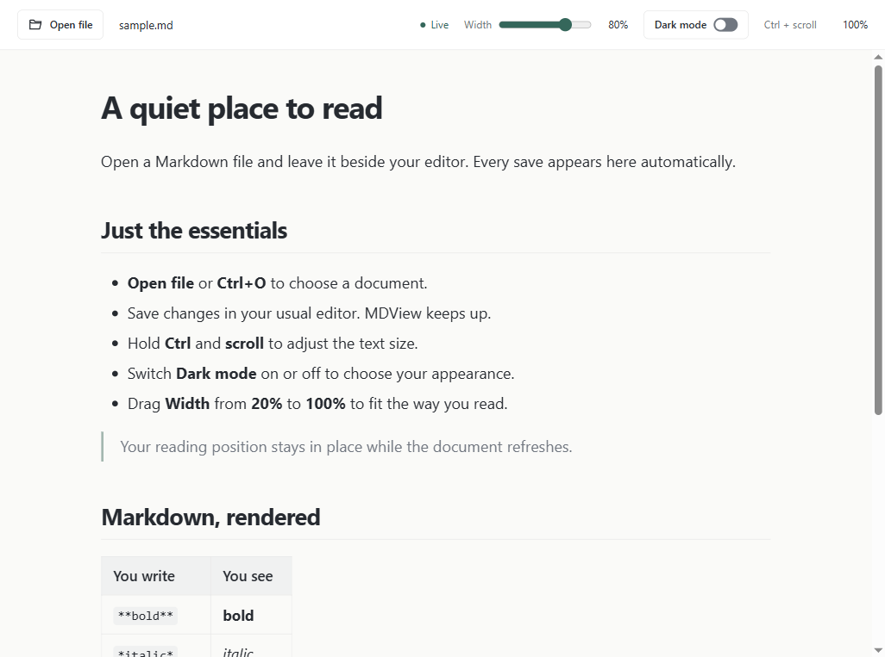

# MDView

[](https://github.com/Simonsbs/MDView/actions/workflows/build.yml)
[](https://github.com/Simonsbs/MDView/releases/latest)
[](LICENSE)

**A simple Markdown viewer for Windows and Linux.** Open a file, keep writing in your preferred editor, and see saved changes appear automatically. Hold **Ctrl** and scroll to change the text size.

MDView exists for people who want a readable preview beside their editor, without an editing workspace, account or configuration screen. It reads your files without changing them.



## Download and install

Download packages from the **[latest release](https://github.com/Simonsbs/MDView/releases/latest)**. Node.js is not required to run a packaged app.

| Platform | Package | Use |
| --- | --- | --- |
| Windows x64 | `MDView-<version>-windows-x64-setup.exe` | Installer, Start menu entry and `.md` registration |
| Windows x64 | `MDView-<version>-windows-x64-portable.exe` | Run without an installer |
| Ubuntu / Debian x64 | `MDView-<version>-linux-x64.deb` | Install using the system package manager |
| Linux x64 | `MDView-<version>-linux-x64.AppImage` | Make executable and run |
| Linux x64 | `MDView-<version>-linux-x64.tar.gz` | Extract and run `./mdview` |

The release includes `SHA256SUMS.txt`. These community packages are unsigned. See **[installation instructions](docs/installation.md)** for commands, requirements, default-app registration, updates and removal.

## Use it

1. Choose **Open file**, press **Ctrl+O**, drop a file into the window, or double-click a `.md` file once MDView is its default application.
2. Edit and save in your usual editor. The preview updates automatically.
3. Hold **Ctrl** and scroll up or down to resize the document text.
4. Use **Dark mode** in the toolbar to switch between light and dark appearance.
5. Drag the **Width** slider from **20%** to **100%**. At 100%, the document uses the full available window width with small edge margins. The starting width is 80%.

Text size and reading position stay in place during refresh. Ordinary scrolling works as usual. The toolbar stays the same size.

Your theme and width choices are remembered when you reopen MDView. Until you choose a theme, the app follows your system's light or dark appearance. The width slider also supports the arrow keys, Home for 20%, and End for 100%.

### Default application for `.md`

The Windows installer registers MDView and offers to open Windows Default apps at the end of setup. Select **MDView** for **`.md`** there. Windows requires this confirmation when replacing an existing protected choice.

On Linux, a packaged app registers itself as the current user's Markdown default on its first launch. This applies to Markdown, not ordinary `.txt` files. An explicit `--make-default` launch repeats registration on either platform; this also supports portable packages kept at a stable location.

See [the platform-specific steps](docs/installation.md#default-application) for details.

## What it supports

- `.md`, `.markdown`, `.mdown` and `.mkd` files; default-app registration targets `.md`.
- Headings, lists, tables, task lists, quotes, links, images and fenced code blocks.
- Local images relative to the document; web images load from their original URLs.
- Links to websites open in your browser. Links to other Markdown files open in MDView.
- Normal saves, atomic file replacement, and recovery when a file is deleted and recreated.
- UTF-8 and UTF-16 files with byte-order marks.
- Text sizes from 50% to 300%, a light/dark mode switch, and reading widths from 20% to 100%.

Native file events are backed by a check every 750 ms. A temporarily unavailable file keeps its last successful preview. Files have a 32 MB limit. Text size is remembered for the current session.

Raw HTML is shown as text. Scripts in Markdown do not execute. MDView does not upload documents or send telemetry, although a document's remote images make requests to their image hosts. It does not edit files, render Mermaid diagrams, or provide syntax highlighting.

## Build and test

Use **Node.js 24 LTS** and npm. The minimum supported Node.js version is 22.22.1.

```sh
git clone https://github.com/Simonsbs/MDView.git
cd MDView
npm ci
npm start
```

```sh
npm test
npm run test:ui
npm run dist:win           # Windows installer and portable app, on Windows
npm run dist:linux         # AppImage, .deb and archive, on Linux
```

On Linux without a display, use `xvfb-run -a npm run test:ui`. Build outputs go to `release/`. A Linux archive can be built on Windows using `npm run dist:linux:archive`.

See [development](docs/development.md) for architecture and tests, and [releasing](docs/releasing.md) for the versioning and publication process.

## Contribute and get help

- [Report a bug or request an improvement](https://github.com/Simonsbs/MDView/issues/new/choose).
- Read [CONTRIBUTING.md](CONTRIBUTING.md) and the [code of conduct](CODE_OF_CONDUCT.md).
- Report vulnerabilities using the [security policy](SECURITY.md).
- See the [changelog](CHANGELOG.md) for the version history.

Maintained by [Simon B.Stirling](https://github.com/Simonsbs). Contributions that keep the viewer simple are welcome.

## Licence

MDView is available under the [MIT licence](LICENSE). Third-party components retain their own licences; see [THIRD_PARTY_NOTICES.md](THIRD_PARTY_NOTICES.md). Desktop packages include the Electron and Chromium notices.
